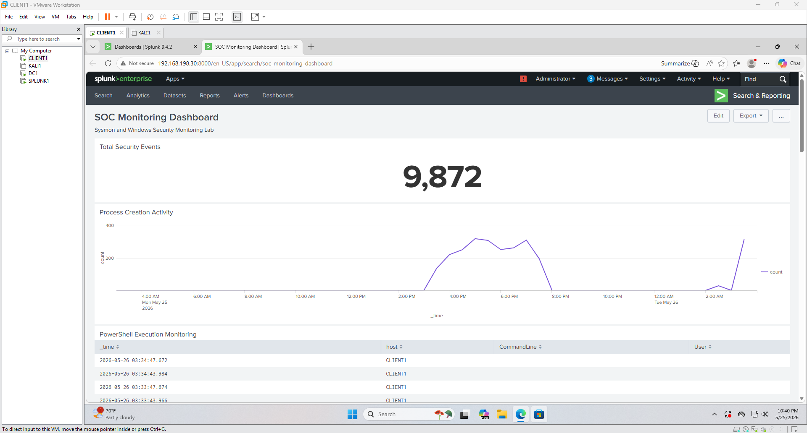
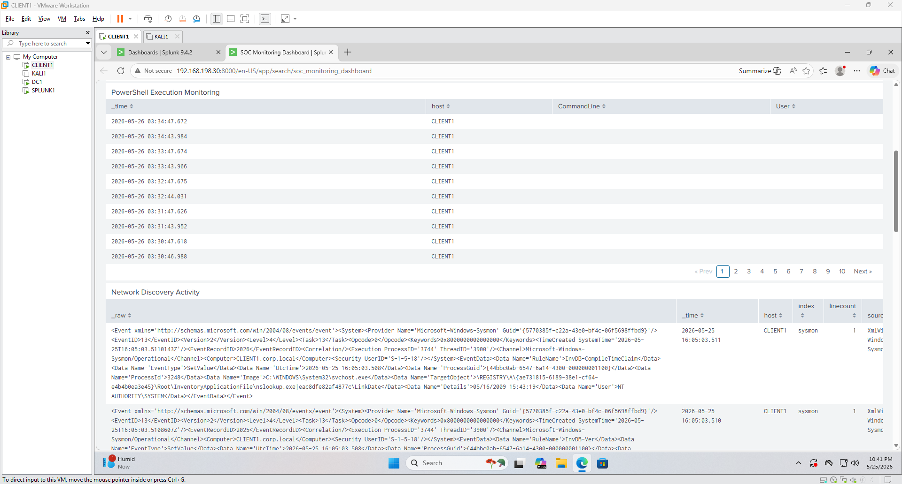
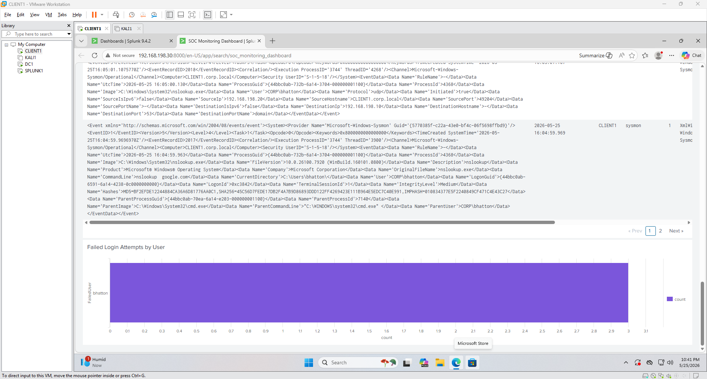
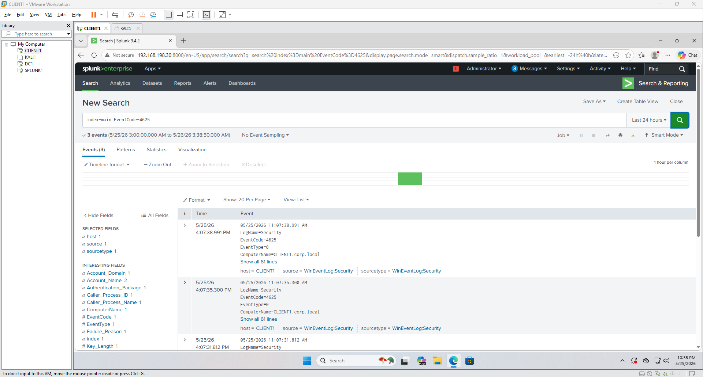
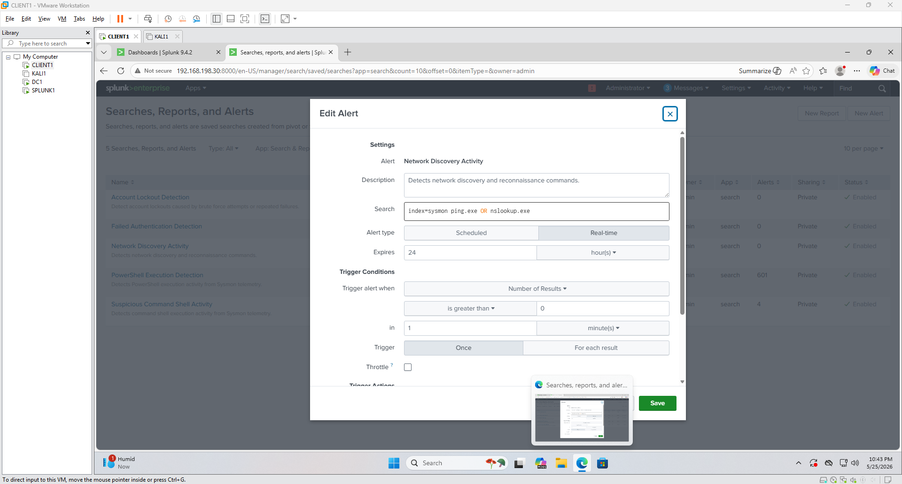
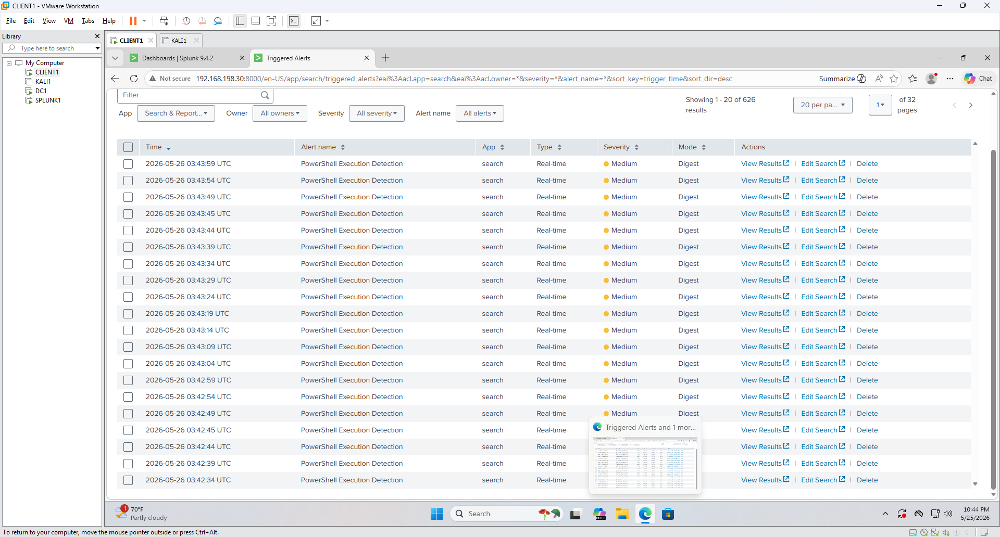
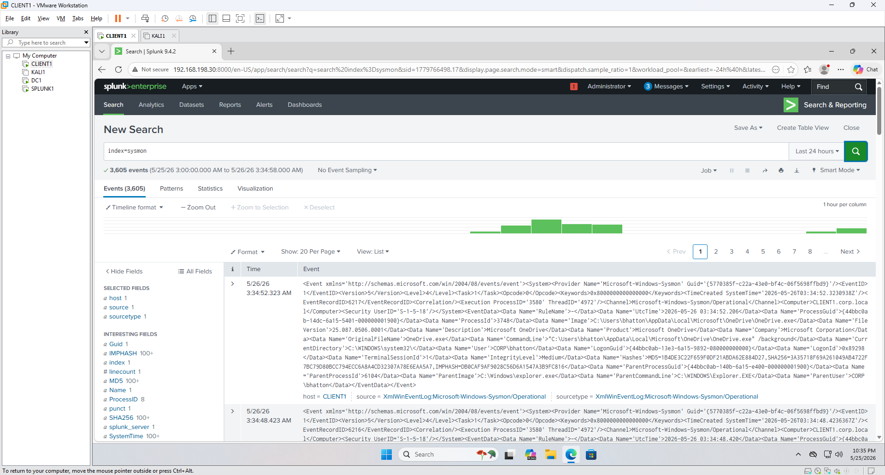
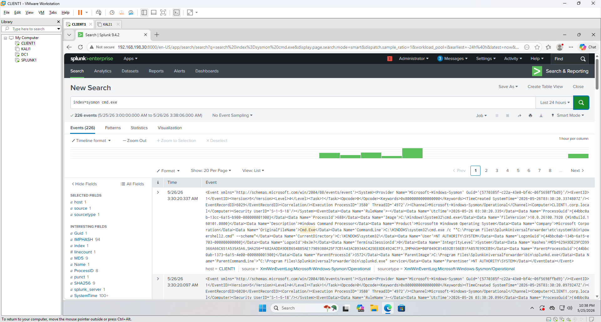

# Homelab Project 2: Splunk SIEM Security Monitoring Lab

## Overview
Built and configured a Splunk SIEM monitoring environment to develop hands-on experience in security monitoring, threat detection, log analysis, and alerting. Configured Splunk Enterprise, Sysmon telemetry collection, and Universal Forwarders to centralize Windows security logs and simulate enterprise SOC monitoring workflows.

Implemented custom searches, dashboards, and alerts to monitor authentication activity, PowerShell execution, process creation events, and network discovery activity. Validated detections through controlled attack simulations and real-time event analysis.

---

# Objectives
- Deploy and configure Splunk Enterprise SIEM
- Configure Sysmon endpoint telemetry collection
- Centralize Windows Security and Sysmon logs
- Configure Splunk Universal Forwarders
- Build SOC-style dashboards and detections
- Create real-time security alerts
- Simulate attack activity to validate detections
- Develop practical SIEM investigation and monitoring skills

---

# Environment
- Splunk Enterprise 9.4.2
- Windows 11 Endpoint Monitoring System
- Kali Linux Attack Simulation System
- Sysmon Telemetry Collection
- Splunk Universal Forwarder
- VMware Workstation

---

# Architecture Diagram

The diagram below illustrates the Splunk SIEM architecture, endpoint telemetry flow, and centralized log collection process used throughout the lab.


---

# Key Components
- SPLUNK1 (Splunk Enterprise SIEM Server)
- CLIENT1 (Windows Endpoint Monitoring System)
- KALI1 (Attack Simulation System)
- Sysmon Endpoint Telemetry
- Splunk Search & Reporting Application
- SOC Monitoring Dashboard
- Real-Time Detection Alerts

---

# Tools Used
- Splunk Enterprise
- Splunk Universal Forwarder
- Sysmon
- VMware Workstation
- Windows Event Viewer
- PowerShell
- Windows Defender Firewall
- Kali Linux

---

# Security Implementation

## SIEM Deployment
- Installed and configured Splunk Enterprise
- Configured centralized log ingestion from Windows systems
- Deployed Splunk Universal Forwarder on monitored endpoints
- Validated telemetry ingestion into Splunk indexes

## Sysmon Telemetry Collection
- Installed Sysmon endpoint monitoring
- Configured Sysmon operational logging
- Monitored process creation activity
- Collected PowerShell execution telemetry
- Captured command-line process activity
- Centralized Sysmon telemetry within Splunk

## Detection Engineering
Created custom Splunk searches and real-time alerts for:
- Failed authentication attempts
- PowerShell execution activity
- Command shell execution
- Network discovery and reconnaissance activity
- Process creation monitoring

## SOC Dashboard Development
Built a centralized SOC-style monitoring dashboard to visualize:
- Total security event activity
- Process creation trends
- PowerShell execution monitoring
- Failed login activity
- Network discovery activity
- Real-time event monitoring

---

# Monitoring and Detection

## Security Monitoring Searches

### Failed Authentication Monitoring

```spl
index=main EventCode=4625
```

### PowerShell Execution Detection

```spl
index=sysmon powershell.exe
```

### Command Execution Monitoring

```spl
index=sysmon cmd.exe
```

### Network Discovery Activity

```spl
index=sysmon ping.exe OR nslookup.exe
```

### Sysmon Telemetry Monitoring

```spl
index=sysmon
```

---

# Real-Time Alerts Configured

| Alert Name | Severity | Purpose |
|---|---|---|
| Failed Authentication Detection | High | Detect repeated failed login attempts |
| PowerShell Execution Detection | Medium | Monitor suspicious PowerShell execution |
| Suspicious Command Shell Activity | Medium | Detect command shell execution activity |
| Network Discovery Activity | Medium | Detect reconnaissance-related commands |
| Account Lockout Detection | High | Detect account lockout activity |

---

# Attack Simulation

To validate the configured detections and monitoring capabilities, the following simulations were performed:

- Executed PowerShell commands to generate Sysmon telemetry
- Performed failed login attempts to trigger authentication monitoring
- Executed command shell activity using cmd.exe
- Performed network discovery activity using ping and nslookup
- Generated process creation events to validate telemetry collection
- Triggered real-time alerts within Splunk

Results:
- Security telemetry was successfully ingested into Splunk
- Real-time alerts triggered as expected
- Dashboard visualizations updated dynamically
- PowerShell and command execution activity was detected
- Failed login activity was logged and searchable
- Network discovery activity was successfully monitored

---

# Validation and Testing

Screenshots are included in the [Screenshots](Screenshots/) directory to demonstrate deployment, telemetry ingestion, monitoring, alerting, and dashboard functionality throughout the lab.

Configuration files can be found in the [Configurations](Configurations/) directory.

Custom Splunk searches are included in the [Queries](Queries/) directory.

---

# Dashboard Monitoring

## SOC Monitoring Dashboard
Centralized SOC dashboard displaying overall security monitoring activity.




---

## PowerShell Execution Monitoring
PowerShell execution telemetry monitored through Sysmon logs.


---

## Failed Login Activity
Failed authentication attempts successfully detected and monitored.



---

## Network Discovery Detection
Detection of reconnaissance-related commands such as nslookup and ping.



---

## Triggered Real-Time Alerts
Real-time alerts triggered through configured Splunk detections.



---

## Sysmon Telemetry Ingestion
Validation of Sysmon telemetry ingestion into Splunk.



---

## Command Execution Monitoring
Command-line execution activity detected through Sysmon telemetry.



---

# Repository Structure

```text
Project1-Splunk-SIEM-Homelab
│
├── README.md
│
├── Screenshots
│   ├── Dashboard.png
│   ├── PowerShell-Detection.png
│   ├── Failed-Login-Detection.png
│   ├── Network-Discovery-Detection.png
│   ├── Triggered-Alerts.png
│   ├── Sysmon-Logs.png
│   ├── CMD-Execution.png
│
├── Queries
│   ├── Searches.txt
│
├── Configurations
│   ├── Alert-Configurations.txt
│   ├── Dashboard-Queries.txt
```

---

# Key Takeaways
- Deployed and configured a functional Splunk SIEM environment
- Centralized Windows Security and Sysmon telemetry
- Developed practical experience with SIEM log analysis and monitoring
- Built SOC-style dashboards and visualizations
- Created custom Splunk detections and real-time alerts
- Simulated attack activity to validate monitoring capabilities
- Gained hands-on experience with endpoint telemetry collection
- Performed event analysis using Splunk Search Processing Language (SPL)

---

# Skills Demonstrated

## SIEM & Security Monitoring
- Splunk Enterprise Administration
- Security Information and Event Management (SIEM)
- Security Event Monitoring
- Log Aggregation and Analysis
- Security Dashboard Development

## Detection Engineering
- Splunk Search Processing Language (SPL)
- Real-Time Alert Development
- Threat Detection
- Authentication Monitoring
- Process Execution Monitoring

## Endpoint Telemetry
- Sysmon Configuration and Monitoring
- Windows Event Log Analysis
- PowerShell Activity Monitoring
- Process Creation Monitoring
- Command-Line Auditing

## Incident Detection & Analysis
- Threat Hunting
- Security Event Investigation
- Alert Triage
- Attack Simulation Validation
- Security Monitoring Workflows

---

# Lessons Learned
This project provided practical experience with:
- SIEM deployment and configuration
- Endpoint telemetry collection
- Windows Security Event analysis
- Detection engineering workflows
- Security monitoring and alert validation
- Attack simulation and event investigation

The lab also improved troubleshooting skills related to log ingestion, dashboard development, alert tuning, and Windows event monitoring.

---

# Future Improvements
Planned future enhancements for the lab include:
- Microsoft Sentinel integration
- Cloud SIEM monitoring
- Additional Sysmon detection tuning
- Expanded attack simulation scenarios
- Threat hunting dashboards

---

# Project Status
Completed — Splunk SIEM environment successfully deployed, telemetry centralized, detections configured, dashboards created, and monitoring functionality validated through simulated attack activity and real-time alerting.
